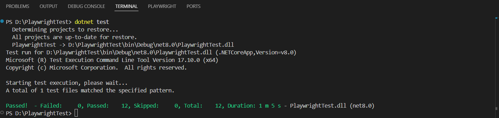

## 📂 Project Structure
* **`PlayWrightTests.cs`**: Implementation of 10 test cases plus additional scenarios using **C#** and **Playwright**.
* **`test_plane_quest_global.pdf`**: Comprehensive Test Plan including strategy, additional test scenarios (T1-T4), and application improvement recommendations.

## 🧪 Automated Scenarios
1. **User Management**: Register User, Login (Correct/Incorrect), Register with existing email, Logout, and Delete Account.
2. **Shopping Cart**: Add to cart, Remove from cart, and Verify product quantity.
3. **Product & Reviews**: Search product by keyword, and Add review on product.
4. **Checkout Process**: Verification of address details in the checkout page.

## 🐛 Bug Report - Negative Testing (Scenario T3)
During the automation of **T3 (Payment Field Input Validation)**, a bug was identified:
* **Requirement**: The system should validate input fields, display an error message, and prevent the transaction if non-numeric data (letters) is entered in the Card Number, CVV, or Expiration fields.
* **Actual Result**: The application accepts alphabetic characters and successfully confirms the order.
* **Automation Approach**:The test is designed to pass the full flow to demonstrate the end-to-end execution, while highlighting the validation failure in the Test Plan.

## 🛠️ How to Run the Tests
* dotnet test
